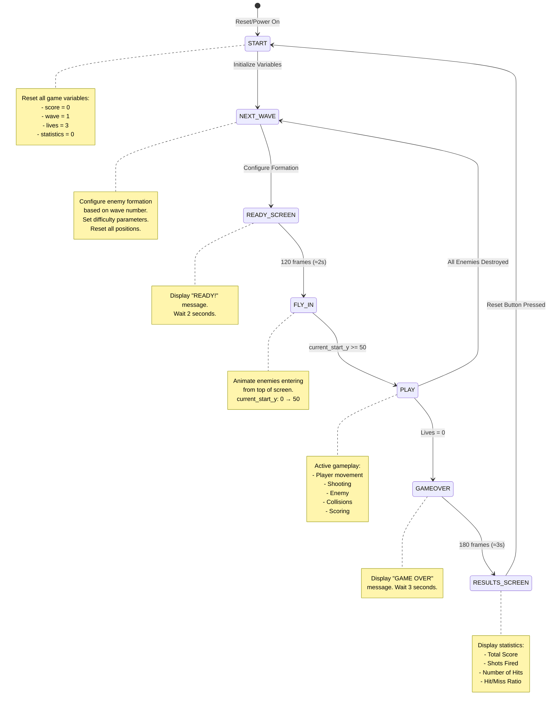

# Final Project: Video Game Galaga (CPE 487)
## Lily Stone and Michael Moschello

This project implements a sophisticated recreation of the arcade classic **Galaga** on the Digilent Nexys A7-100T FPGA board. Written entirely in VHDL, the system features a custom VGA graphics engine, complex enemy reasoning, sprite-based rendering, and a finite state machine (FSM) game loop.

## Expected Behavior

### Gameplay Flow
Upon power-on or reset, the game follows this sequence:

1. **Initialization (START state):** Game resets all variables, sets wave number to 1, lives to 3, and score to 0
2. **Wave Setup (NEXT_WAVE state):** Configures enemy formation based on wave number, sets difficulty parameters
3. **Ready Screen (READY_SCREEN state):** Displays "READY!" message for approximately 2 seconds (120 frames at 60Hz)
4. **Fly-In Animation (FLY_IN state):** Enemy formation animates flying in from the top of the screen, moving from y=0 to y=50
5. **Active Gameplay (PLAY state):** 
   - Player controls ship at bottom of screen (y=550)
   - Enemy formation moves horizontally, bouncing off screen edges
   - Formation "breathes" vertically (expands and contracts)
   - Individual enemies perform dive attacks toward player
   - Squad attacks fly in from the side
   - Enemies fire bullets at player
   - Player can shoot and destroy enemies
   - Score increments by 1 point per enemy destroyed
6. **Wave Completion:** When all enemies destroyed, wave number increments and returns to NEXT_WAVE state
7. **Game Over (GAMEOVER state):** When player lives reach 0, displays "GAME OVER" for 3 seconds
8. **Results Screen (RESULTS_SCREEN state):** Shows detailed statistics including score, shots fired, hits, and accuracy percentage

### Visual Outputs
- **VGA Monitor:** Displays game graphics at 800×600 resolution, 60Hz refresh rate
  - Player ship: Green Galaga-style fighter at bottom
  - Enemy formation: 6×10 grid with three enemy types (Bees=Yellow, Crabs=Red, Walkers=Magenta)
  - Starfield: Procedurally generated scrolling stars in background
  - Text overlays: "LEVEL XX" counter, "READY!", "GAME OVER", statistics
- **7-Segment Display:** Shows 4-digit score in decimal format (0000-9999)
- **LEDs:** LEDs 13-15 indicate remaining lives (LED 15=3+ lives, LED 14=2+ lives, LED 13=1+ life)

### Performance Characteristics
- **Frame Rate:** Consistent 60 FPS synchronized with VGA vertical sync
- **Real-time Rendering:** No frame buffering - pixels generated on-the-fly as VGA controller requests them
- **Responsive Controls:** Button inputs debounced to prevent glitches
- **Smooth Animation:** All movement calculated at 60Hz for fluid motion

The project demonstrates advanced digital logic design concepts including:
*   **VGA Signal Generation:** Custom timing logic for 800x600 @ 60Hz resolution.
*   **Sprite Rendering:** Pixel-perfect bitmap rendering for the player and multiple enemy types.
*   **Finite State Machines:** Managing game states (Start, Play, Next Wave, Game Over, Results).
*   **Pseudo-Random Number Generation (PRNG):** Using hash-based algorithms for starfield generation and enemy attack patterns.
*   **Collision Detection:** Real-time bounding box checks for multiple moving objects.

## Detailed Game Mechanics

### 1. The Player
The player controls a fighter ship at the bottom of the screen.
*   **Movement:** Smooth horizontal movement using `BTNL` and `BTNR`.
*   **Weaponry:** A rapid-fire cannon (`BTN0`) capable of destroying enemies in a single hit.
*   **Lives:** The player starts with 3 lives. A life is lost upon collision with an enemy ship or an enemy projectile.

### 2. The Enemy Fleet
The core of the game is the enemy formation, which evolves in difficulty.
*   **Formation Grid:** A 6-row by 10-column grid of enemies.
*   **Enemy Classes:**
    *   **Bees (Yellow):** Agile units in the front rows (Rows 4-5).
    *   **Crabs (Red):** The bulk of the force in the middle rows (Rows 2-3).
    *   **Walkers (Magenta):** Elite units in the back rows (Rows 0-1), appearing in later waves.
*   **Dynamic Behaviors:**
    *   **"Breathing" Formation:** The entire grid expands and contracts vertically while moving horizontally, mimicking the organic movement of the original game.
    *   **Dive Attacks:** Individual enemies will break formation and swoop down towards the player in a curve.
    *   **Squad Fly-Ins:** A "Squad Leader" (Bee) accompanied by two "Wingmen" (Crabs) will occasionally fly in from the side of the screen in a coordinated attack pattern.
    *   **Enemy Fire:** Enemies utilize two types of attacks:
        *   **Single Shot:** Randomly fired from the formation based on a difficulty timer.
        *   **Triple Shot:** Fired by diving enemies, spreading out to cover a wide area.

### 3. Game Progression & Scoring
*   **Infinite Waves:** The game has no end. When a wave is cleared, a new wave begins with increased difficulty (faster movement, higher fire rate).
*   **Scoring System:**
    *   **Formation Kill:** 10 Points.
    *   **Diver Kill:** 50 Points (Bonus for hitting a moving target).
*   **Results Screen:** Upon Game Over, a detailed statistics screen displays:
    *   Total Score
    *   Shots Fired
    *   Number of Hits
    *   Hit/Miss Ratio (Accuracy %)

## Required Hardware and Attachments

### Essential Components
*   **FPGA Board:** Digilent Nexys A7-100T (Artix-7 XC7A100T-1CSG324C)
*   **VGA Monitor:** Standard VGA monitor supporting 800×600 @ 60Hz resolution
*   **VGA Cable:** Standard VGA cable (15-pin D-sub connector) OR HDMI-to-VGA active adapter
*   **USB Cable:** Micro-USB cable for power and programming
*   **Computer:** Windows/Linux system with Vivado installed for synthesis and programming

## Instructions to Run the Project

### 1. Project Setup in Vivado
1.  Create a new RTL project named **galaga**.
2.  Select the target board: **Nexys A7-100T**.
3.  Add the following source files (VHDL):
    *   `galaga.vhd`
    *   `galaga_game.vhd`
    *   `vga_sync.vhd`
    *   `leddec16.vhd`
    *   `clk_wiz_0.vhd` & `clk_wiz_0_clk_wiz.vhd`
4.  Add the constraint file:
    *   `galaga.xdc`

### 2. Synthesis & Implementation
1.  Click **Run Synthesis** and wait for completion.
2.  Click **Run Implementation**.
3.  Click **Generate Bitstream**.

### 3. Programming
1.  Connect the Nexys A7 board.
2.  Open **Hardware Manager** > **Open Target** > **Auto Connect**.
3.  Click **Program Device** and select the `galaga.bit` file.

### 4. Controls
| Button | Action |
| :--- | :--- |
| **BTNL** | Move Ship Left |
| **BTNR** | Move Ship Right |
| **BTN0 (Center)** | Fire Laser |
| **BTNU (Up)** | Reset Game |

## Inputs and Outputs to/from Nexys Board

This section describes all inputs from and outputs to the Nexys A7-100T board.

### Inputs (From Board to FPGA)

| Signal Name | Width | Board Pin | I/O Standard | Description | Source |
| :--- | :--- | :--- | :--- | :--- | :--- |
| `clk_in` | 1-bit | E3 | LVCMOS33 | 100 MHz system clock | Board oscillator |
| `btnl` | 1-bit | P17 | LVCMOS33 | Left button - move ship left | User input |
| `btnr` | 1-bit | M17 | LVCMOS33 | Right button - move ship right | User input |
| `btn0` | 1-bit | N17 | LVCMOS33 | Center button - fire laser | User input |
| `btnu` | 1-bit | M18 | LVCMOS33 | Up button - reset game | User input |

**Input Modifications from Starter Code:**
- **`btnu` (Reset Button):** This input was added to the project. We added this button to provide a dedicated reset function, mapped to pin M18 in the constraint file.

### Outputs (From FPGA to Board)

#### VGA Display Outputs

| Signal Name | Width | Board Pins | I/O Standard | Description |
| :--- | :--- | :--- | :--- | :--- |
| `VGA_red` | 4-bit | A3, B4, C5, A4 | LVCMOS33 | Red color channel (4-bit) |
| `VGA_green` | 4-bit | C6, A5, B6, A6 | LVCMOS33 | Green color channel (4-bit) |
| `VGA_blue` | 4-bit | B7, C7, D7, D8 | LVCMOS33 | Blue color channel (4-bit) |
| `VGA_hsync` | 1-bit | B11 | LVCMOS33 | Horizontal sync signal |
| `VGA_vsync` | 1-bit | B12 | LVCMOS33 | Vertical sync signal |

**VGA Output Details:**
- All VGA outputs were present in the starter code and remain unchanged
- 4-bit color depth provides 16 levels per color channel (4096 total colors)
- Sync signals follow VESA 800×600 @ 60Hz standard

#### 7-Segment Display Outputs

| Signal Name | Width | Board Pins | I/O Standard | Description |
| :--- | :--- | :--- | :--- | :--- |
| `SEG7_seg[6:0]` | 7-bit | L18, T11, P15, K13, K16, R10, T10 | LVCMOS33 | Segment patterns (a-g) |
| `SEG7_anode[7:0]` | 8-bit | J17, J18, T9, J14, P14, T14, K2, U13 | LVCMOS33 | Digit select anodes |

**7-Segment Display Details:**
- Present in starter code, used to display score
- **Modification:** Score now displays in **decimal format** (BCD) instead of hexadecimal
- Binary-to-BCD conversion was added in `galaga.vhd` to ensure decimal display
- This demonstrates data format conversion and output modification

#### LED Outputs

| Signal Name | Width | Board Pins | I/O Standard | Description |
| :--- | :--- | :--- | :--- | :--- |
| `led[15]` | 1-bit | V11 | LVCMOS33 | Life indicator (3+ lives) |
| `led[14]` | 1-bit | V12 | LVCMOS33 | Life indicator (2+ lives) |
| `led[13]` | 1-bit | V14 | LVCMOS33 | Life indicator (1+ life) |
| `led[12:0]` | 13-bit | V15, T16, U14, T15, V16, U16, U17, V17, R18, N14, J13, K15, H17 | LVCMOS33 | Unused (always 0) |

**LED Output Modifications:**
- **All LED outputs were ADDED** to this project
- The starter code (Pong) did not use LEDs
- LEDs 13-15 provide visual feedback for remaining lives:
  - LED 15 ON = 3 or more lives
  - LED 14 ON = 2 or more lives  
  - LED 13 ON = 1 or more lives
- All LED mappings were added to `galaga.xdc` constraint file
- This demonstrates adding new outputs and modifying both the VHDL entity and constraint file

### Constraint File (.xdc) Modifications

The constraint file `galaga.xdc` was modified from the original `pong.xdc`:

**Additions:**
1. **Reset Button Mapping:**
   ```tcl
   set_property -dict { PACKAGE_PIN M18 IOSTANDARD LVCMOS33 } [get_ports { btnu }];
   ```

2. **LED Output Mappings (16 LEDs):**
   ```tcl
   set_property -dict { PACKAGE_PIN H17 IOSTANDARD LVCMOS33 } [get_ports { led[0] }];
   set_property -dict { PACKAGE_PIN K15 IOSTANDARD LVCMOS33 } [get_ports { led[1] }];
   ... (all 16 LEDs mapped)
   ```

**Unchanged:**
- All VGA pin mappings (red, green, blue, hsync, vsync)
- All 7-segment display pin mappings
- Clock input pin mapping
- Button mappings for btnl, btnr, btn0

### Port Modifications Summary

**Entity Port Changes in `galaga.vhd`:**
- **Added Input:** `btnu : IN STD_LOGIC` - Reset button
- **Added Output:** `led : OUT STD_LOGIC_VECTOR(15 DOWNTO 0)` - LED array for lives display
- **Modified:** Score output now uses BCD conversion (internal change, port unchanged)

**Component Port Changes:**
- `galaga_game` component: Added `reset` input port (connected to `btnu`)
- All other component ports remain compatible with starter code

## Technical Implementation

### System Architecture
The design is modular, separating the game logic from the display drivers and input handling.

### Finite State Machine Diagram

The game uses a 7-state finite state machine to manage game flow. The following diagram shows all states and transitions:



**State Descriptions:**
- **START:** Initial state, resets all game variables (score, wave, lives, statistics)
- **NEXT_WAVE:** Configures enemy formation based on wave number, sets difficulty parameters, resets positions
- **READY_SCREEN:** Displays "READY!" message, waits 2 seconds (120 frames at 60Hz)
- **FLY_IN:** Animates enemies entering from top of screen (current_start_y: 0 → 50)
- **PLAY:** Active gameplay state where all game logic executes (movement, shooting, collisions)
- **GAMEOVER:** Displays "GAME OVER" message, waits 3 seconds (180 frames)
- **RESULTS_SCREEN:** Shows statistics (score, shots, hits, accuracy), waits for reset

**State Transition Conditions:**
- START → NEXT_WAVE: Immediate (automatic initialization)
- NEXT_WAVE → READY_SCREEN: After formation configuration complete
- READY_SCREEN → FLY_IN: After 120 frames (ready_timer_counter = 120)
- FLY_IN → PLAY: When current_start_y >= 50 (enemies in position)
- PLAY → NEXT_WAVE: When enemies_remaining = 0 (wave cleared)
- PLAY → GAMEOVER: When lives_count = 0 (player defeated)
- GAMEOVER → RESULTS_SCREEN: After 180 frames (game_over_timer > 180)
- RESULTS_SCREEN → START: When reset button (btnu) pressed

**Boolean Logic in State Machine:**
The FSM uses combinational logic to determine state transitions:
- `IF enemies_remaining = 0 THEN next_state = NEXT_WAVE`
- `IF lives_count = 0 THEN next_state = GAMEOVER`
- `IF ready_timer_counter = 120 THEN next_state = FLY_IN`
- `IF current_start_y >= 50 THEN next_state = PLAY`
- `IF reset = '1' THEN next_state = START`

### System Architecture Block Diagram

The following high-level block diagram illustrates how the major components of the Galaga game system connect together and interact. This diagram shows the complete data flow from user inputs through the FPGA logic to the various output devices.

**Diagram Overview:**
- **Inputs (Top):** Shows the physical inputs from the Nexys board (buttons and system clock)
- **FPGA Logic (Center):** Represents the internal processing modules implemented in VHDL
- **Outputs (Bottom):** Shows the physical outputs to display devices (VGA monitor, 7-segment display, LEDs)

**Key Data Flows:**
1. **Clock Distribution:** System clock (100 MHz) enters the Clock Wizard, which generates the pixel clock (25 MHz) needed for VGA timing
2. **User Input:** Button presses flow directly into the Game Core, controlling player actions
3. **Pixel Generation:** VGA Controller provides pixel coordinates to Game Core, which calculates RGB color values in real-time
4. **Display Output:** Game Core sends color data back to VGA Controller, which formats it with sync signals for the monitor
5. **Score Display:** Game Core outputs binary score data, which is converted to BCD and sent to the 7-segment display controller
6. **Status Indicators:** Game Core outputs lives count to drive the LED indicators

This architecture demonstrates a modular design where each component has a specific responsibility, making the system easier to understand, debug, and modify.

```mermaid
graph TD
    subgraph Inputs
        Btn["Buttons (L, R, Fire, Reset)"]
        Clk["100 MHz System Clock"]
    end

    subgraph FPGA_Logic
        ClkWiz["Clock Wizard<br/>(100MHz -> 25MHz)"]
        
        subgraph Game_Core
            FSM["Finite State Machine<br/>(Start, Play, Over)"]
            Physics["Physics Engine<br/>(Movement, Collision)"]
            ["Enemy <br/>(Timers, Patterns)"]
            Renderer["Sprite Renderer<br/>(Bitmaps, Color Mux)"]
        end
        
        VGA["VGA Controller<br/>(Sync Signals, Counters)"]
        Seg7["7-Segment Controller<br/>(Score Display)"]
    end

    subgraph Outputs
        Monitor["VGA Monitor<br/>(800x600 RGB)"]
        Display["7-Segment Display<br/>(Score)"]
        LEDs["Board LEDs<br/>(Debug/Status)"]
    end

    Clk --> ClkWiz
    ClkWiz --> VGA
    Btn --> Game_Core
    VGA -- Pixel Coordinates --> Game_Core
    Game_Core -- RGB Data --> VGA
    Game_Core -- Score Data --> Seg7
    VGA --> Monitor
    Seg7 --> Display
``` 

### Key Modules
*   **`galaga.vhd` (Top Level):** Instantiates all sub-modules and maps physical ports. Handles the global reset and clock distribution.
*   **`galaga_game.vhd` (Game Engine):** The largest module (approx. 1300 lines). It contains:
    *   **Sprite Bitmaps:** Constant arrays defining the 16x16 pixel art for all characters.
    *   **Starfield Generator:** A mathematical hash function based on pixel coordinates to generate a scrolling star background without using memory.
    *   **Object Tracking:** Arrays and signals to track the position and status (`alive`/`dead`) of 60+ entities simultaneously.
*   **`vga_sync.vhd`:** Generates standard VESA 800x600 timing signals. It provides the current `pixel_row` and `pixel_col` to the game engine, which determines the color of that pixel in real-time.
*   **`leddec16.vhd`:** Multiplexes the 4-digit score onto the 7-segment display.

## Modifications from Starter Code

### Starter Code Source
This project is built upon **Lab 6: Pong** starter code. The Pong game provided a solid foundation with:
- VGA display system (`vga_sync.vhd`)
- 7-segment display driver (`leddec16.vhd`)
- Clock management (`clk_wiz_0` files)
- Basic game structure (`pong.vhd` and `bat_n_ball.vhd`)
- Constraint file (`pong.xdc`)

### Unchanged Modules
The following modules were kept **completely unchanged** from the starter code:
- **`vga_sync.vhd`:** VGA timing generation (no modifications needed)
- **`leddec16.vhd`:** 7-segment display multiplexing (works as-is)
- **`clk_wiz_0.vhd` and `clk_wiz_0_clk_wiz.vhd`:** Clock wizard IP (generated by Vivado)

These modules provide essential infrastructure and required no modifications for our game.

### Major Modifications

### Constraint File Modifications (`galaga.xdc`)

**File Renamed:** `pong.xdc` → `galaga.xdc`

**Additions:**
1. **Reset Button Mapping (NEW):**
   ```tcl
   set_property -dict { PACKAGE_PIN M18 IOSTANDARD LVCMOS33 } [get_ports { btnu }];
   ```
   - Added mapping for `btnu` (up button) to serve as game reset
   - This button was not used in the Pong game

2. **LED Output Mappings (NEW - 16 LEDs):**
   ```tcl
   set_property -dict { PACKAGE_PIN H17 IOSTANDARD LVCMOS33 } [get_ports { led[0] }];
   set_property -dict { PACKAGE_PIN K15 IOSTANDARD LVCMOS33 } [get_ports { led[1] }];
   ... (all 16 LEDs mapped)
   ```
   - Added complete LED array mapping (LEDs 0-15)
   - LEDs 13-15 used for lives display
   - LEDs 0-12 reserved for future use (currently unused)

**Unchanged:**
- All VGA pin mappings (red[3:0], green[3:0], blue[3:0], hsync, vsync)
- All 7-segment display mappings (SEG7_seg[6:0], SEG7_anode[7:0])
- System clock mapping (clk_in on pin E3)
- Button mappings for btnl, btnr, btn0 (left, right, center buttons) 

### Top-Level Module Modifications (`galaga.vhd`)

**File Renamed:** `pong.vhd` → `galaga.vhd`

**Entity Port Changes:**
- **Added Input:** `btnu : IN STD_LOGIC` - Reset button (mapped to up button)
- **Added Output:** `led : OUT STD_LOGIC_VECTOR(15 DOWNTO 0)` - LED array for lives display
- **Unchanged:** All VGA outputs, 7-segment outputs, clock input, other buttons

**Architecture Modifications:**

1. **New Signal Declarations:**
   - `score_binary : STD_LOGIC_VECTOR(15 DOWNTO 0)` - Binary score from game
   - `display : STD_LOGIC_VECTOR(15 DOWNTO 0)` - BCD score for display
   - `lives_out : STD_LOGIC_VECTOR(2 DOWNTO 0)` - Lives count from game

2. **Binary-to-BCD Conversion Process (NEW):**
   - **Completely new functionality** not present in Pong
   - Converts 16-bit binary score to 4-digit BCD format
   - Ensures score displays in decimal (0-9) instead of hexadecimal (0-F)
   - Process runs combinatorially, updating whenever score changes

3. **LED Display Logic (NEW):**
   - **New process** to drive LEDs based on lives count
   - LEDs 13-15 indicate remaining lives (3, 2, or 1)
   - Logic: `led(15) = '1' when lives >= 3`, etc.

4. **Component Instantiation Changes:**
   - `galaga_game` component replaces `bat_n_ball` component
   - Port mappings updated to match new game interface
   - Added `reset` port connection to `btnu` button

5. **Player Movement Process:**
   - Modified from Pong's paddle movement
   - Changed boundary limits (20 to 780 instead of Pong's limits)
   - Movement speed adjusted (5 pixels per button press)
   - Debouncing logic retained from starter code

### Game Engine Modifications (`galaga_game.vhd`)

**File Created:** Completely new file (replaces `bat_n_ball.vhd`)

**Size Comparison:**
- Pong's `bat_n_ball.vhd`: ~200-300 lines
- Our `galaga_game.vhd`: ~1,463 lines
- **~5x larger** with significantly more complex logic

**Major New Features:**

1. **Finite State Machine (NEW):**
   - 7-state FSM vs. Pong's simple game loop
   - States: START, READY_SCREEN, FLY_IN, PLAY, NEXT_WAVE, GAMEOVER, RESULTS_SCREEN
   - Complex state transitions with timers and conditions

2. **Sprite Rendering System (NEW):**
   - **4 sprite types** defined as 16×16 bitmaps:
     - `galaga_sprite` - Player ship
     - `bee_sprite` - Yellow enemies
     - `crab_sprite` - Red enemies
     - `walker_sprite` - Magenta elite enemies
   - Sprite scaling (2×) for larger on-screen appearance
   - Multiple rendering processes for different object types

3. **Enemy Formation System (NEW):**
   - 6×10 grid (60 positions) vs. Pong's 2 paddles
   - Array-based tracking: `enemy_alive[row, col]` and `enemy_is_diving[row, col]`
   - Dynamic formation patterns that change with wave number
   - "Breathing" animation (vertical expansion/contraction)

4. **Enemy Behaviors (NEW):**
   - **Formation Movement:** Horizontal movement with edge bouncing
   - **Dive Attacks:** Individual enemies break formation and dive toward player
   - **Squad Fly-Ins:** Special attack patterns with leader and wingmen
   - **Random Shooting:** Formation enemies fire bullets at player
   - **Triple Shot:** Diving enemies fire spread shots

5. **Collision Detection System (ENHANCED):**
   - Pong had simple paddle-ball collision
   - Galaga implements **5 collision types:**
     - Player bullet vs. formation enemies (60 positions)
     - Player bullet vs. diving enemies
     - Player bullet vs. squad enemies
     - Enemy bullets vs. player (single + triple shots)
     - Enemy ships vs. player (formation + divers)
   - Uses AABB (Axis-Aligned Bounding Box) algorithm

6. **Starfield Background (NEW):**
   - Procedural generation using hash function
   - No memory required - generated on-the-fly
   - Scrolling animation synchronized with game
   - Multiple star colors from hash algorithm

7. **Text Rendering System (NEW):**
   - Custom 5×7 pixel font
   - 26+ character definitions (letters, numbers, symbols)
   - Renders: "LEVEL XX", "READY!", "GAME OVER", statistics
   - Helper functions for character and digit rendering

8. **Scoring and Statistics (ENHANCED):**
   - Pong: Simple score increment
   - Galaga: 
     - Score tracking (16-bit binary)
     - Shots fired counter
     - Hits counter
     - Hit/miss ratio calculation
     - Results screen with detailed statistics

9. **Wave Progression System (NEW):**
   - Infinite waves with increasing difficulty
   - Formation patterns change by wave (4 → 12 → 24 → 40 → 60 enemies)
   - Difficulty scaling: faster movement, higher fire rate
   - Wave number display on screen

10. **Game State Management (NEW):**
    - Ready screen with timer
    - Fly-in animation state
    - Game over screen with timer
    - Results screen with statistics
    - Wave transition logic

**Code Statistics:**
- **Constants:** 50+ game parameters (sizes, speeds, timings)
- **Signals:** 40+ internal signals for game state
- **Processes:** 6 major processes (star_draw, player_draw, enemy_draw, bullet_draw, enemy_bullet_draw, text_draw, game_logic)
- **Arrays:** Multiple 2D arrays for enemy tracking and sprites
- **Functions:** Helper functions for text rendering

### Summary of Modifications

| Component | Status | Description |
| :--- | :--- | :--- |
| `vga_sync.vhd` | Unchanged | VGA timing (reused as-is) |
| `leddec16.vhd` | Unchanged | 7-segment driver (reused as-is) |
| `clk_wiz_0` files | Unchanged | Clock wizard (reused as-is) |
| `galaga.vhd` | Heavily Modified | Added BCD conversion, LED logic, new component |
| `galaga_game.vhd` | Completely New | Entire game engine from scratch |
| `galaga.xdc` | Modified | Added reset button and LED mappings |

#### galaga.vhd
This file begins with the entity declaration definining the inputs and outputs as followed:
* Inputs:
   * `clk_in`: System clock
   * `btnl`, `btnr`, `btn0`, `btnu`: Buttons (left, right, shoot, reset)
* Outputs:
   * `VGA_red/green/blue`: VGA color (4 bit vectors)
   * `VGA_hsync`, `VGA_vsync`: VGA sync signals
   * `led`: LEDs for lives indicator (16 bit vectors)
   * `SEG7_anode`, `SEG7_seg`: 7-segment display control

 Within the architecture, many internal signals were declared:
 * `pxl_clk`: Pixel clock
 * `S_red/green/blue`: Single bit color from game
 * `S_red_vec/green_vec/blue_vec`: 4-bit color vectors for VGA
 * `S_vsync`: Vertical sync from VGA module.
 * `S_pixel_row/col`: Current pixel coordinates
 * `player_pos`: Player X position
 * `count`: Counter for debouncing and multiplexing
 * `display`: BCD score for 7-segment display
 * `score_binary`: Binary score from game
 * `led_mpx`: Multiplexing selector for 7-segment digits
 * `shoot_signal`: Shoot button signal
 * `lives_out`: Lives count from game

The architecture contains several key processes and component instantiations:

**Player Movement Process:**
The `player_movement` process handles button debouncing and player ship positioning. It uses the `count` signal to debounce button inputs, preventing rapid movement. When `btnl` (left) is pressed and the player is not at the left boundary (position > 20), the player position decreases by 5 pixels. Similarly, when `btnr` (right) is pressed and the player is not at the right boundary (position < 780), the position increases by 5 pixels.

**7-Segment Display Multiplexing:**
The `led_mpx` signal is derived from bits 19-17 of the `count` signal, creating a multiplexing clock that cycles through the four 7-segment digits fast enough to appear continuous to the human eye.

**Color Signal Conversion:**
The game engine outputs single-bit color signals (`S_red`, `S_green`, `S_blue`), which are converted to 4-bit vectors for VGA output by concatenating three zeros to each signal. This allows the VGA interface to receive proper 4-bit color data.

**Binary-to-BCD Conversion:**
A combinational process converts the binary score from the game engine into Binary Coded Decimal (BCD) format for display on the 7-segment display. The process extracts each decimal digit (ones, tens, hundreds, thousands) using modulo and division operations, then formats them as 4-bit BCD values.

**Component Instantiations:**
* **`game_inst` (galaga_game):** The core game engine that handles all game logic, sprite rendering, collision detection, and state management.
* **`vga_driver` (vga_sync):** Generates VGA timing signals and provides pixel coordinates to the game engine.
* **`clk_wiz_0_inst` (clk_wiz_0):** Converts the 100 MHz system clock to approximately 25 MHz pixel clock required for VGA timing.
* **`led1` (leddec16):** Multiplexes the 4-digit BCD score onto the 7-segment display.

**LED Display Logic:**
The LEDs are used to display remaining lives. LED 15 lights up when the player has 3 or more lives, LED 14 for 2 or more lives, and LED 13 for 1 or more lives. This provides a visual indicator of the player's remaining lives.

#### galaga_game.vhd
This is the core game engine module. It implements the complete game logic including:

**Game States:**
The game uses a finite state machine with the following states:
* **START:** Initial state when the game is reset
* **READY_SCREEN:** Brief pause before gameplay begins
* **FLY_IN:** Animation of enemies entering the screen
* **PLAY:** Active gameplay state
* **NEXT_WAVE:** Transition between waves
* **GAMEOVER:** Game over state
* **RESULTS_SCREEN:** Statistics display after game over

**Sprite System:**
The game defines three enemy sprite types as 16x16 pixel bitmaps:
* **`bee_sprite`:** Yellow enemies in the front rows
* **`crab_sprite`:** Red enemies in the middle rows
* **`walker_sprite`:** Magenta elite enemies in the back rows (appear in later waves)
* **`galaga_sprite`:** The player ship sprite

Each sprite is defined as a 2D array of bits, where '1' represents a pixel that should be drawn and '0' represents transparency.

**Enemy Formation:**
The game maintains a 6-row by 10-column grid of enemies (60 total positions). Each position is tracked with:
* **`enemy_alive`:** Boolean array indicating if an enemy exists at that position
* **`enemy_is_diving`:** Boolean array indicating if an enemy has left formation for a dive attack

**Enemy Behaviors:**
* **Formation Movement:** The entire grid moves horizontally, bouncing off screen edges and "breathing" vertically (expanding and contracting).
* **Dive Attacks:** Individual enemies break formation and dive toward the player in curved paths, firing triple-shot attacks.
* **Squad Fly-Ins:** Special attack patterns where a leader and two wingmen fly in from the side of the screen.
* **Random Fire:** Enemies in formation randomly fire single bullets at the player based on difficulty timers.

**Collision Detection:**
The game implements real-time collision detection for:
* Player bullets vs. formation enemies
* Player bullets vs. diving enemies
* Player bullets vs. squad enemies
* Enemy bullets vs. player ship
* Enemy ships vs. player ship (physical collision)

All collisions use bounding box detection, checking if object positions overlap within their size boundaries.

**Starfield Background:**
A procedural starfield is generated using a hash function based on pixel coordinates. This creates a scrolling star background without requiring memory storage. The hash function uses pixel position to determine if a star exists at that location and what color it should be.

**Scoring System:**
* Formation enemy kill: 1 point
* Diving enemy kill: 1 point (previously 50, now standardized)
* Score is tracked as a 16-bit binary value and converted to BCD for display

**Difficulty Scaling:**
As waves progress, the game increases difficulty by:
* Reducing enemy shoot delay (faster firing rate)
* Increasing enemy movement speed (faster horizontal movement)
* Expanding enemy formations (more enemies in later waves)

**Statistics Tracking:**
The game tracks:
* Total shots fired
* Total hits landed
* Hit/miss ratio (accuracy percentage)
These statistics are displayed on the results screen after game over.

**Implementation Details:**

**Rendering System:**
The game uses a pixel-by-pixel rendering approach synchronized with the VGA controller. Four main drawing processes determine what color each pixel should be:

1. **`player_draw` Process:** Renders the player ship sprite at the bottom of the screen. The process:
   - Calculates the sprite's bounding box based on `player_x_pos` and fixed `player_y` (550)
   - Uses `SPRITE_SCALE` (2) to scale the 16x16 sprite to 32x32 pixels
   - Maps current pixel coordinates to sprite indices by dividing by the scale factor
   - Checks the sprite bitmap array (`galaga_sprite`) to determine if the pixel should be drawn
   - Outputs `player_on` signal when a sprite pixel is detected

2. **`enemy_draw` Process:** Handles rendering of all enemy types (formation, divers, and squad):
   - Iterates through the 6×10 enemy grid to check formation enemies
   - Determines sprite type based on row (Walker for rows 0-1, Crab for 2-3, Bee for 4-5)
   - Calculates each enemy's position using: `enemy_x_pos + (col × ENEMY_SPACING_X)` and `current_start_y + enemy_y_offset + (row × ENEMY_SPACING_Y)`
   - Renders diving enemies separately using their individual `diver_x` and `diver_y` positions
   - Renders squad attacks with leader at `squad_x/y` and wingmen offset by ±20 pixels
   - Assigns color based on enemy type: Red (100) for Crabs, Yellow (110) for Bees, Magenta (101) for Walkers

3. **`bullet_draw` Process:** Renders player bullets as circular sprites:
   - Uses distance calculation: `(dx² + dy²) < bullet_size²` to create circular bullets
   - Only renders when `bullet_active = '1'`
   - Bullets move upward by subtracting `bullet_speed` (16 pixels per frame) from `bullet_y`

4. **`enemy_bullet_draw` Process:** Handles both single and triple-shot enemy bullets:
   - Single bullets from formation use `enemy_bullet_x/y` and `enemy_bullet_active`
   - Triple shots use separate signals: `eb_L_active/C_active/R_active` with their own positions
   - Left and right bullets spread horizontally by ±3 pixels per frame while moving down

**State Machine Implementation:**
The game logic runs in a single synchronous process (`game_logic`) that executes on every rising edge of `v_sync` (vertical sync, ~60Hz). The state machine transitions:

- **START → NEXT_WAVE:** Immediately initializes game variables and sets up the first wave
- **NEXT_WAVE → READY_SCREEN:** Configures enemy formation based on wave number, sets difficulty parameters, resets all active objects
- **READY_SCREEN → FLY_IN:** After 120 frames (~2 seconds), begins enemy fly-in animation
- **FLY_IN → PLAY:** When `current_start_y` reaches 50, gameplay begins
- **PLAY → NEXT_WAVE:** When all enemies are destroyed (`enemies_remaining = 0`)
- **PLAY → GAMEOVER:** When player lives reach 0
- **GAMEOVER → RESULTS_SCREEN:** After 180 frames (~3 seconds)
- **RESULTS_SCREEN:** Waits indefinitely for reset

**Collision Detection Algorithm:**
All collisions use axis-aligned bounding box (AABB) detection. For two objects at positions (x1, y1) and (x2, y2) with sizes size1 and size2:

```vhdl
IF x1 >= x2 - size2 AND x1 <= x2 + size2 AND
   y1 >= y2 - size2 AND y1 <= y2 + size2 THEN
    -- Collision detected
END IF;
```

The game checks collisions in this order:
1. Player bullet vs. Diver (before formation check to prioritize moving targets)
2. Player bullet vs. Formation enemies (iterates through all 60 positions)
3. Enemy bullets vs. Player (single shot and all three triple shots)
4. Enemy ships vs. Player (formation and divers)

A `collision_found` flag prevents multiple collisions from the same bullet.

**Starfield Generation:**
The starfield uses a hash-based procedural generation algorithm in the `star_draw` process:

```vhdl
seed := ((pixel_col * 129) + (row_scrolled * 743)) XOR ((pixel_col * row_scrolled) + 93);
```

Where `row_scrolled = pixel_row + star_scroll_y`. The algorithm:
- Uses pixel coordinates as input to a deterministic hash function
- Checks if the lower 9 bits are all zero (1/512 probability = star density)
- Uses middle bits (11:9) for star color (RGB values)
- Scrolls by incrementing `star_scroll_y` every 4 frames
- Requires no memory - stars are generated on-the-fly based on position

**Enemy Implementation:**

**Formation Movement:**
- Uses `enemy_move_counter` that increments each frame
- When counter reaches `move_threshold` (decreases with wave number for faster movement):
  - Moves `enemy_x_pos` by `enemy_speed` (4 pixels) in current direction
  - When hitting screen edge, reverses `enemy_direction` and applies "breathing" logic
  - Breathing alternates between moving formation down (`formation_move_dir = 0`) and up (`formation_move_dir = 1`)
  - Vertical offset ranges from 0 to 100 pixels, creating expansion/contraction effect

**Dive Attack Logic:**
- Uses `diver_timer` and `random_col` (incremented each frame) for pseudo-random selection
- When timer exceeds `shoot_delay + 20`, scans columns from bottom row upward
- Selects first available enemy that's alive and not already diving
- Sets `enemy_is_diving[row, col] = '1'` to mark position as occupied
- Diver movement:
  - Vertical: `diver_y <= diver_y + enemy_bullet_speed + 1` (7 pixels/frame)
  - Horizontal: Homing behavior - moves 3 pixels toward `player_x_pos` each frame
- Fires triple shot when `diver_y > 200` and `diver_shot_fired = '0'`
- Returns to formation (or dies) when `diver_y > 600`

**Squad Attack:**
- Uses `squad_timer` that increments each frame
- Triggers when `squad_timer > 1000` (~16 seconds) and `squad_active = '0'`
- Squad starts at left edge (`squad_x = 0`) with random Y position
- Movement: `squad_x <= squad_x + 4`, `squad_y <= squad_y + 2` (diagonal swoop)
- Fires bullets at x-positions 200, 400, and 600
- Deactivates when off-screen (`squad_x > 800` or `squad_y > 600`)

**Enemy Shooting:**
- Formation enemies use `enemy_shoot_timer` that increments each frame
- When timer exceeds `shoot_delay` (decreases with wave number):
  - Uses `random_col` to select a random column
  - Finds bottom-most alive enemy in that column (scans rows 5→0)
  - Activates `enemy_bullet_active` and sets bullet position to enemy position
- Bullet moves: `enemy_bullet_y <= enemy_bullet_y + enemy_bullet_speed` (6 pixels/frame)

**Text Rendering System:**
The game includes a custom 5×7 pixel font system for displaying text:

- **Font Definition:** Each character is a 2D array (`font_char`) with 7 rows × 5 columns
- **`text_draw` Process:** Renders text at specific screen coordinates:
  - Calculates character index from pixel position: `char_idx = x_rel / (CHAR_W * SCALE)`
  - Extracts pixel within character: `char_col = (x_rel MOD (CHAR_W * SCALE)) / SCALE`
  - Uses helper function `get_char_bit()` to retrieve bit value from font array
  - Supports rendering: "LEVEL XX", "READY!", "GAME OVER", and results screen statistics
  - Numbers are converted using `get_digit_char()` function that maps integers 0-9 to font arrays

**Wave Progression System:**
Each wave has a different formation pattern set in the `NEXT_WAVE` state:

- **Wave 1:** 4 enemies (Row 1, Columns 3-6) - Tutorial level
- **Wave 2:** 12 enemies (Rows 0-1, Columns 2-7) - Small formation
- **Wave 3:** 24 enemies (Rows 0-2, Columns 1-8) - Medium formation
- **Wave 4:** 40 enemies (Rows 0-3, all columns) - Large formation
- **Wave 5+:** 60 enemies (All 6 rows, all 10 columns) - Full formation

Difficulty scales with wave number:
- `shoot_delay = 40 - (wave_number × 3)` for waves 1-10 (minimum 10)
- `move_threshold = 6 - (wave_number / 3)` for waves 1-10 (minimum 2)
- After wave 10, difficulty caps at maximum values

**Color Priority System:**
The final pixel color is determined by priority in `galaga.vhd`:
1. **Text** (highest priority) - White when `text_on = '1'`
2. **Enemies/Bullets** - Red, Yellow, or Magenta based on enemy type
3. **Player/Bullet** - Green
4. **Stars** - Various colors from hash function (lowest priority)

This ensures text is always visible, enemies appear above stars, and player is clearly visible.

**Synchronization:**
The entire game logic runs synchronously with VGA vertical sync:
- `v_sync` signal pulses once per frame (~60Hz)
- All game state updates occur on `rising_edge(v_sync)`
- This ensures game logic runs at a consistent 60 FPS
- Rendering processes are combinational, calculating pixel colors based on current game state
- No frame buffering - pixels are generated in real-time as VGA controller requests them

#### vga_sync.vhd
This module generates standard VESA 800x600 @ 60Hz VGA timing signals. It implements:
* **Horizontal Timing:** 800 visible pixels + 40 front porch + 128 sync pulse + 88 back porch = 1056 total pixels per line
* **Vertical Timing:** 600 visible lines + 1 front porch + 4 sync pulse + 23 back porch = 628 total lines per frame
* **Pixel Clock:** Approximately 25 MHz (derived from the clock wizard)
* **Output Signals:** Provides `pixel_row` and `pixel_col` coordinates to the game engine, and generates `hsync` and `vsync` signals for the monitor
* **Video Blanking:** Suppresses color output during non-visible periods (blanking intervals)

#### leddec16.vhd
This module handles 7-segment display multiplexing:
* **Input:** 16-bit BCD data (4 digits × 4 bits) and a 3-bit digit selector
* **Function:** Selects one 4-bit digit from the input data based on the selector, converts it to 7-segment pattern, and enables the corresponding anode
* **Output:** 7-segment pattern (7 bits for segments a-g) and anode enable signal (8 bits, though only 4 are typically used)
* **Multiplexing:** The parent module rapidly cycles through digits, creating the illusion that all four digits are simultaneously lit

#### clk_wiz_0 Files
The clock wizard files (`clk_wiz_0.vhd` and `clk_wiz_0_clk_wiz.vhd`) are generated by Vivado's Clock Wizard IP core:
* **Purpose:** Convert the 100 MHz system clock to approximately 25 MHz pixel clock
* **Implementation:** Uses Xilinx MMCM (Mixed-Mode Clock Manager) primitive
* **Features:** Low jitter output, phase alignment, and stable frequency generation
* **Input:** 100 MHz system clock from pin E3
* **Output:** ~25 MHz pixel clock for VGA timing

## Images and Videos

### Screenshots

*[Placeholder for game screenshots - add images showing:]*
- Gameplay screenshot showing enemy formation
- Ready screen with "READY!" message
- Game over screen
- Results screen with statistics
- Multiple waves showing different formations

### Video Demonstration

*[Placeholder for video link - add video showing:]*
- Game startup sequence
- Player movement and shooting
- Enemy dive attacks
- Wave progression
- Game over and results screen

### Hardware Setup Images

*[Placeholder for hardware images - add photos showing:]*
- Nexys A7 board connected to VGA monitor
- Close-up of board showing LEDs and 7-segment display
- Overall setup with cables and connections

**Note:** Images and videos should be added to demonstrate the project in action. These provide visual context for reviewers and help verify the project works as described.

## Required Hardware
*   **FPGA:** Digilent Nexys A7-100T (Artix-7).
*   **Display:** Standard VGA Monitor (supports 800x600 @ 60Hz).
*   **Connection:** VGA Cable (or HDMI with active VGA adapter).
*   **Power/Prog:** Micro-USB cable.

## Future Improvements

### Potential Enhancements

1. **Audio System:**
   - Add sound effects using PWM audio output
   - Implement shooting sounds, explosion effects, background music
   - Use Nexys A7's audio jack or PMOD audio module

2. **High-Score System:**
   - Implement non-volatile storage for high scores
   - Use block RAM or external memory to retain scores across power cycles
   - Display high score on startup screen

3. **Bonus Rounds:**
   - Add "Challenging Stages" similar to original arcade game
   - Special enemy formations that award bonus points
   - Time-limited bonus rounds

4. **Enhanced Graphics:**
   - Add explosion animations when enemies are destroyed
   - Implement sprite animation (multiple frames per enemy)
   - Add particle effects for bullet impacts

5. **Gameplay Features:**
   - Power-up system (faster shooting, spread shot)
   - Boss enemies at end of waves
   - Multiple difficulty levels selectable at start

6. **Performance Optimizations:**
   - Pipeline collision detection for better timing
   - Optimize sprite rendering for faster frame rates
   - Reduce resource usage for larger FPGAs

## Conclusion

This project successfully transforms a simple Pong game into a complex Galaga implementation. The modifications demonstrate:

- **Understanding of VHDL architecture:** Creating complex state machines and game logic
- **System integration:** Connecting multiple modules and managing data flow
- **Hardware interfacing:** Adding new inputs/outputs and constraint file modifications
- **Algorithm implementation:** Collision detection, behaviors, procedural generation
- **Real-time systems:** Synchronizing game logic with VGA display at 60 FPS

### Summary of Process

The development of this Galaga game followed an iterative, incremental approach, starting with a minimal prototype and gradually adding features and complexity. This section documents the evolution of the project from initial concept to final implementation.

#### Phase 1: Basic Prototype
The project began with the simplest possible implementation to establish core functionality:
- **Player Ship:** A basic triangle shape rendered at the bottom of the screen
- **Enemies:** Simple square shapes arranged in a basic formation
- **Shooting Mechanics:** Player could fire bullets that would destroy enemies on contact
- **Basic Collision:** Simple bounding box collision detection between bullets and enemies
- **Enemy Removal:** Enemies would disappear when hit by player bullets

This minimal version verified that the core game loop (input → update → render) worked correctly and that collision detection functioned as expected.

#### Phase 2: Enhanced Graphics and Movement
With the basic mechanics working, the next phase focused on improving visual appearance and adding more dynamic movement:
- **Sprite Bitmaps:** Replaced simple geometric shapes with detailed 16×16 pixel bitmap sprites
  - Created custom Galaga-style player ship sprite
  - Designed enemy sprites (Bees, Crabs, Walkers) with distinct appearances
  - Implemented sprite scaling (2×) for larger on-screen appearance
- **Enemy Movement:** Enhanced enemy formation behavior
  - Added horizontal movement with edge bouncing
  - Implemented "breathing" animation (vertical expansion/contraction)
  - Created smooth, organic movement patterns

#### Phase 3: Gameplay Refinement
Once graphics were established, the focus shifted to making the game more engaging:
- **Enemy Behaviors:** Added complex enemy attack patterns
  - Implemented dive attacks where individual enemies break formation
  - Created squad fly-in attacks with leader and wingmen
  - Added random enemy shooting from formation
  - Implemented triple-shot attacks from diving enemies
- **Gameplay Balancing:** Fine-tuned various parameters
  - Adjusted bullet speeds for better feel
  - Calibrated enemy movement speeds
  - Balanced difficulty progression
  - Refined collision detection for accuracy

#### Phase 4: Game Structure and Progression
To create a complete game experience, structured progression systems were added:
- **Wave System:** Implemented infinite wave progression
  - Created different formation patterns for early waves (4 → 12 → 24 → 40 → 60 enemies)
  - Added difficulty scaling (faster movement, higher fire rate with each wave)
  - Implemented wave number display on screen
- **Lives System:** Added player life management
  - Started with 3 lives
  - Lives decrease on collision with enemies or enemy bullets
  - Visual feedback via LEDs on the board
  - Game over when lives reach zero
- **State Machine:** Implemented complete game flow
  - Added START, READY_SCREEN, FLY_IN, PLAY, NEXT_WAVE, GAMEOVER, and RESULTS_SCREEN states
  - Created smooth transitions between game phases
  - Added timers for screen displays

#### Phase 5: Visual Polish and Background
To enhance the visual experience, background elements and polish were added:
- **Starfield Background:** Implemented procedural starfield generation
  - Created hash-based algorithm for deterministic star placement
  - Added scrolling animation synchronized with game
  - Multiple star colors from hash function
  - No memory required - generated on-the-fly
- **Text Rendering:** Added custom font system
  - Created 5×7 pixel font with 26+ characters
  - Implemented text rendering for "LEVEL XX", "READY!", "GAME OVER"
  - Added statistics display on results screen

#### Phase 6: Scoring and Statistics
To provide player feedback and replay value, comprehensive statistics were implemented:
- **Scoring System:** 
  - Tracked score as 16-bit binary value
  - Converted to BCD for decimal display on 7-segment display
  - Standardized scoring (1 point per enemy)
- **Statistics Tracking:**
  - Shots fired counter
  - Hits counter
  - Hit/miss ratio calculation (accuracy percentage)
  - Results screen displaying all statistics

We worked on these iterations together, bouncing ideas of each other and implementing them one by one. We created the baseline of the project together in class. Michael took the board home and worked on implementing the waves and background. Then Lily took the board and finished bug fixes and smoothed game mechanics. Lily also completed the report, while Michael worked on the poster. 

**Credits**: Starter code from Lab 6 was used. Generative AI was used to create bitmaps for the sprites based on images, to workshop how to implement features in the game, and assisted in creating the diagrams in Markdown format. 
