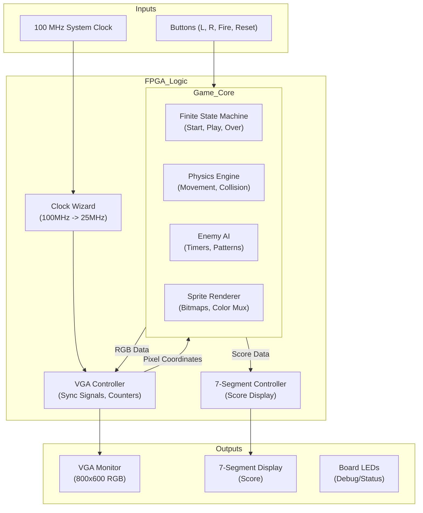

# Final Project: Video Game Galaga (CPE 487)

This project implements a sophisticated recreation of the arcade classic **Galaga** on the Digilent Nexys A7-100T FPGA board. Written entirely in VHDL, the system features a custom VGA graphics engine, complex enemy AI, sprite-based rendering, and a finite state machine (FSM) game loop.

The project demonstrates advanced digital logic design concepts including:
*   **VGA Signal Generation:** Custom timing logic for 800x600 @ 60Hz resolution.
*   **Sprite Rendering:** Pixel-perfect bitmap rendering for the player and multiple enemy types.
*   **Finite State Machines:** Managing game states (Start, Play, Next Wave, Game Over, Results).
*   **Pseudo-Random Number Generation (PRNG):** Using hash-based algorithms for starfield generation and enemy attack patterns.
*   **Collision Detection:** Real-time bounding box checks for multiple moving objects.

## Detailed Game Mechanics

### 1. The Player
The player controls a fighter ship at the bottom of the screen.
*   **Movement:** Smooth horizontal movement using `BTNL` and `BTNR`.
*   **Weaponry:** A rapid-fire cannon (`BTN0`) capable of destroying enemies in a single hit.
*   **Lives:** The player starts with 3 lives. A life is lost upon collision with an enemy ship or an enemy projectile.

### 2. The Enemy Fleet
The core of the game is the enemy formation, which evolves in difficulty.
*   **Formation Grid:** A 6-row by 10-column grid of enemies.
*   **Enemy Classes:**
    *   **Bees (Yellow):** Agile units in the front rows (Rows 4-5).
    *   **Crabs (Red):** The bulk of the force in the middle rows (Rows 2-3).
    *   **Walkers (Magenta):** Elite units in the back rows (Rows 0-1), appearing in later waves.
*   **Dynamic Behaviors:**
    *   **"Breathing" Formation:** The entire grid expands and contracts vertically while moving horizontally, mimicking the organic movement of the original game.
    *   **Dive Attacks:** Individual enemies will break formation and swoop down towards the player in a curve.
    *   **Squad Fly-Ins:** A "Squad Leader" (Bee) accompanied by two "Wingmen" (Crabs) will occasionally fly in from the side of the screen in a coordinated attack pattern.
    *   **Enemy Fire:** Enemies utilize two types of attacks:
        *   **Single Shot:** Randomly fired from the formation based on a difficulty timer.
        *   **Triple Shot:** Fired by diving enemies, spreading out to cover a wide area.

### 3. Game Progression & Scoring
*   **Infinite Waves:** The game has no end. When a wave is cleared, a new wave begins with increased difficulty (faster movement, higher fire rate).
*   **Scoring System:**
    *   **Formation Kill:** 10 Points.
    *   **Diver Kill:** 50 Points (Bonus for hitting a moving target).
*   **Results Screen:** Upon Game Over, a detailed statistics screen displays:
    *   Total Score
    *   Shots Fired
    *   Number of Hits
    *   Hit/Miss Ratio (Accuracy %)

## Instructions to Run the Project

### 1. Project Setup in Vivado
1.  Create a new RTL project named **galaga**.
2.  Select the target board: **Nexys A7-100T**.
3.  Add the following source files (VHDL):
    *   `galaga.vhd`
    *   `galaga_game.vhd`
    *   `vga_sync.vhd`
    *   `leddec16.vhd`
    *   `clk_wiz_0.vhd` & `clk_wiz_0_clk_wiz.vhd`
4.  Add the constraint file:
    *   `galaga.xdc`

### 2. Synthesis & Implementation
1.  Click **Run Synthesis** and wait for completion.
2.  Click **Run Implementation**.
3.  Click **Generate Bitstream**.

### 3. Programming
1.  Connect the Nexys A7 board to your PC via USB.
2.  Open **Hardware Manager** > **Open Target** > **Auto Connect**.
3.  Click **Program Device** and select the `galaga.bit` file.

### 4. Controls
| Button | Action |
| :--- | :--- |
| **BTNL** | Move Ship Left |
| **BTNR** | Move Ship Right |
| **BTN0 (Center)** | Fire Laser |
| **BTNU (Up)** | Reset Game |

## Technical Implementation

### System Architecture
The design is modular, separating the game logic from the display drivers and input handling.

### Key Modules
*   **`galaga.vhd` (Top Level):** Instantiates all sub-modules and maps physical ports. Handles the global reset and clock distribution.
*   **`galaga_game.vhd` (Game Engine):** The largest module (approx. 1300 lines). It contains:
    *   **Sprite Bitmaps:** Constant arrays defining the 16x16 pixel art for all characters.
    *   **Starfield Generator:** A mathematical hash function based on pixel coordinates to generate a scrolling star background without using memory.
    *   **Object Tracking:** Arrays and signals to track the position and status (`alive`/`dead`) of 60+ entities simultaneously.
*   **`vga_sync.vhd`:** Generates standard VESA 800x600 timing signals. It provides the current `pixel_row` and `pixel_col` to the game engine, which determines the color of that pixel in real-time.
*   **`leddec16.vhd`:** Multiplexes the 4-digit score onto the 7-segment display.

## Modifications
We began with the base code from Lab 6, which was Pong. Using this starter code allowed us to easily implement the game. We kept `vga_sync.vhd`, `leddec16.vhd`, `clk_wiz_0.vhd`, and `clk_wiz_0_clk_wiz.vhd` unchanged. This keeps the functionalities of the system and display clock, the LED display, and VGA timing signals. The constraint file, `pong.xdc`, was renamed to `galaga.xdc`.

### Constraint File Modifications
Within `galaga.xdc`, we implemented the mappings for an additional button. We mapped the up button to be used for our restart button. We also added the mappings for the LED outputs. The LED outputs are used to display the lives remaining. 

### Galaga Modifications
The file organization from Pong was used to implement Galaga. In the Pong game, there was the top level file named `pong.vhd` and the game mechanics were within a file named `bat_n_ball.vhd`. Other than the file structure, these files were almost entirely changed. 

#### galaga.vhd
This file begins with the entity declaration definining the inputs and outputs as followed:
* Inputs:
   * `clk_in`: System clock
   * `btnl`, `btnr`, `btn0`, `btnu`: Buttons (left, right, shoot, reset)
* Outputs:
   * `VGA_red/green/blue`: VGA color (4 bit vectors)
   * `VGA_hsync`, `VGA_vsync`: VGA sync signals
   * `led`: LEDs for lives indicator (16 bit vectors)
   * `SEG7_anode`, `SEG7_seg`: 7-segment display control

 Within the architecture, many internal signals were declared:
 * `pxl_clk`: Pixel clock
 * `S_red/green/blue`: Single bit color from game
 * `S_red_vec/green_vec/blue_vec`: 4-bit color vectors for VGA
 * `S_vsync`: Vertical sync from VGA module.
 * `S_pixel_row/col`: Current pixel coordinates
 * `player_pos`: Player X position
 * `count`: Counter for debouncing and multiplexing
 * `display`: BCD score for 7-segment display
 * `score_binary`: Binary score from game
 * `led_mpx`: Multiplexing selector for 7-segment digits
 * `shoot_signal`: Shoot button signal
 * `lives_out`: Lives count from game

The architecture contains several key processes and component instantiations:

**Player Movement Process:**
The `player_movement` process handles button debouncing and player ship positioning. It uses the `count` signal to debounce button inputs, preventing rapid movement. When `btnl` (left) is pressed and the player is not at the left boundary (position > 20), the player position decreases by 5 pixels. Similarly, when `btnr` (right) is pressed and the player is not at the right boundary (position < 780), the position increases by 5 pixels.

**7-Segment Display Multiplexing:**
The `led_mpx` signal is derived from bits 19-17 of the `count` signal, creating a multiplexing clock that cycles through the four 7-segment digits fast enough to appear continuous to the human eye.

**Color Signal Conversion:**
The game engine outputs single-bit color signals (`S_red`, `S_green`, `S_blue`), which are converted to 4-bit vectors for VGA output by concatenating three zeros to each signal. This allows the VGA interface to receive proper 4-bit color data.

**Binary-to-BCD Conversion:**
A combinational process converts the binary score from the game engine into Binary Coded Decimal (BCD) format for display on the 7-segment display. The process extracts each decimal digit (ones, tens, hundreds, thousands) using modulo and division operations, then formats them as 4-bit BCD values.

**Component Instantiations:**
* **`game_inst` (galaga_game):** The core game engine that handles all game logic, sprite rendering, collision detection, and state management.
* **`vga_driver` (vga_sync):** Generates VGA timing signals and provides pixel coordinates to the game engine.
* **`clk_wiz_0_inst` (clk_wiz_0):** Converts the 100 MHz system clock to approximately 25 MHz pixel clock required for VGA timing.
* **`led1` (leddec16):** Multiplexes the 4-digit BCD score onto the 7-segment display.

**LED Display Logic:**
The LEDs are used to display remaining lives. LED 15 lights up when the player has 3 or more lives, LED 14 for 2 or more lives, and LED 13 for 1 or more lives. This provides a visual indicator of the player's remaining lives.

#### galaga_game.vhd
This is the core game engine module. It implements the complete game logic including:

**Game States:**
The game uses a finite state machine with the following states:
* **START:** Initial state when the game is reset
* **READY_SCREEN:** Brief pause before gameplay begins
* **FLY_IN:** Animation of enemies entering the screen
* **PLAY:** Active gameplay state
* **NEXT_WAVE:** Transition between waves
* **GAMEOVER:** Game over state
* **RESULTS_SCREEN:** Statistics display after game over

**Sprite System:**
The game defines three enemy sprite types as 16x16 pixel bitmaps:
* **`bee_sprite`:** Yellow enemies in the front rows
* **`crab_sprite`:** Red enemies in the middle rows
* **`walker_sprite`:** Magenta elite enemies in the back rows (appear in later waves)
* **`galaga_sprite`:** The player ship sprite

Each sprite is defined as a 2D array of bits, where '1' represents a pixel that should be drawn and '0' represents transparency.

**Enemy Formation:**
The game maintains a 6-row by 10-column grid of enemies (60 total positions). Each position is tracked with:
* **`enemy_alive`:** Boolean array indicating if an enemy exists at that position
* **`enemy_is_diving`:** Boolean array indicating if an enemy has left formation for a dive attack

**Enemy AI Behaviors:**
* **Formation Movement:** The entire grid moves horizontally, bouncing off screen edges and "breathing" vertically (expanding and contracting).
* **Dive Attacks:** Individual enemies break formation and dive toward the player in curved paths, firing triple-shot attacks.
* **Squad Fly-Ins:** Special attack patterns where a leader and two wingmen fly in from the side of the screen.
* **Random Fire:** Enemies in formation randomly fire single bullets at the player based on difficulty timers.

**Collision Detection:**
The game implements real-time collision detection for:
* Player bullets vs. formation enemies
* Player bullets vs. diving enemies
* Player bullets vs. squad enemies
* Enemy bullets vs. player ship
* Enemy ships vs. player ship (physical collision)

All collisions use bounding box detection, checking if object positions overlap within their size boundaries.

**Starfield Background:**
A procedural starfield is generated using a hash function based on pixel coordinates. This creates a scrolling star background without requiring memory storage. The hash function uses pixel position to determine if a star exists at that location and what color it should be.

**Scoring System:**
* Formation enemy kill: 1 point
* Diving enemy kill: 1 point (previously 50, now standardized)
* Score is tracked as a 16-bit binary value and converted to BCD for display

**Difficulty Scaling:**
As waves progress, the game increases difficulty by:
* Reducing enemy shoot delay (faster firing rate)
* Increasing enemy movement speed (faster horizontal movement)
* Expanding enemy formations (more enemies in later waves)

**Statistics Tracking:**
The game tracks:
* Total shots fired
* Total hits landed
* Hit/miss ratio (accuracy percentage)
These statistics are displayed on the results screen after game over.

#### vga_sync.vhd
This module generates standard VESA 800x600 @ 60Hz VGA timing signals. It implements:
* **Horizontal Timing:** 800 visible pixels + 40 front porch + 128 sync pulse + 88 back porch = 1056 total pixels per line
* **Vertical Timing:** 600 visible lines + 1 front porch + 4 sync pulse + 23 back porch = 628 total lines per frame
* **Pixel Clock:** Approximately 25 MHz (derived from the clock wizard)
* **Output Signals:** Provides `pixel_row` and `pixel_col` coordinates to the game engine, and generates `hsync` and `vsync` signals for the monitor
* **Video Blanking:** Suppresses color output during non-visible periods (blanking intervals)

#### leddec16.vhd
This module handles 7-segment display multiplexing:
* **Input:** 16-bit BCD data (4 digits × 4 bits) and a 3-bit digit selector
* **Function:** Selects one 4-bit digit from the input data based on the selector, converts it to 7-segment pattern, and enables the corresponding anode
* **Output:** 7-segment pattern (7 bits for segments a-g) and anode enable signal (8 bits, though only 4 are typically used)
* **Multiplexing:** The parent module rapidly cycles through digits, creating the illusion that all four digits are simultaneously lit

#### clk_wiz_0 Files
The clock wizard files (`clk_wiz_0.vhd` and `clk_wiz_0_clk_wiz.vhd`) are generated by Vivado's Clock Wizard IP core:
* **Purpose:** Convert the 100 MHz system clock to approximately 25 MHz pixel clock
* **Implementation:** Uses Xilinx MMCM (Mixed-Mode Clock Manager) primitive
* **Features:** Low jitter output, phase alignment, and stable frequency generation
* **Input:** 100 MHz system clock from pin E3
* **Output:** ~25 MHz pixel clock for VGA timing

## Required Hardware
*   **FPGA:** Digilent Nexys A7-100T (Artix-7).
*   **Display:** Standard VGA Monitor (supports 800x600 @ 60Hz).
*   **Connection:** VGA Cable (or HDMI with active VGA adapter).
*   **Power/Prog:** Micro-USB cable.

## Future Improvements
*   Add sound effects using the PWM audio output.
*   Implement a high-score retention system.
*   Add "Challenging Stages" (bonus rounds) similar to the original arcade game.
