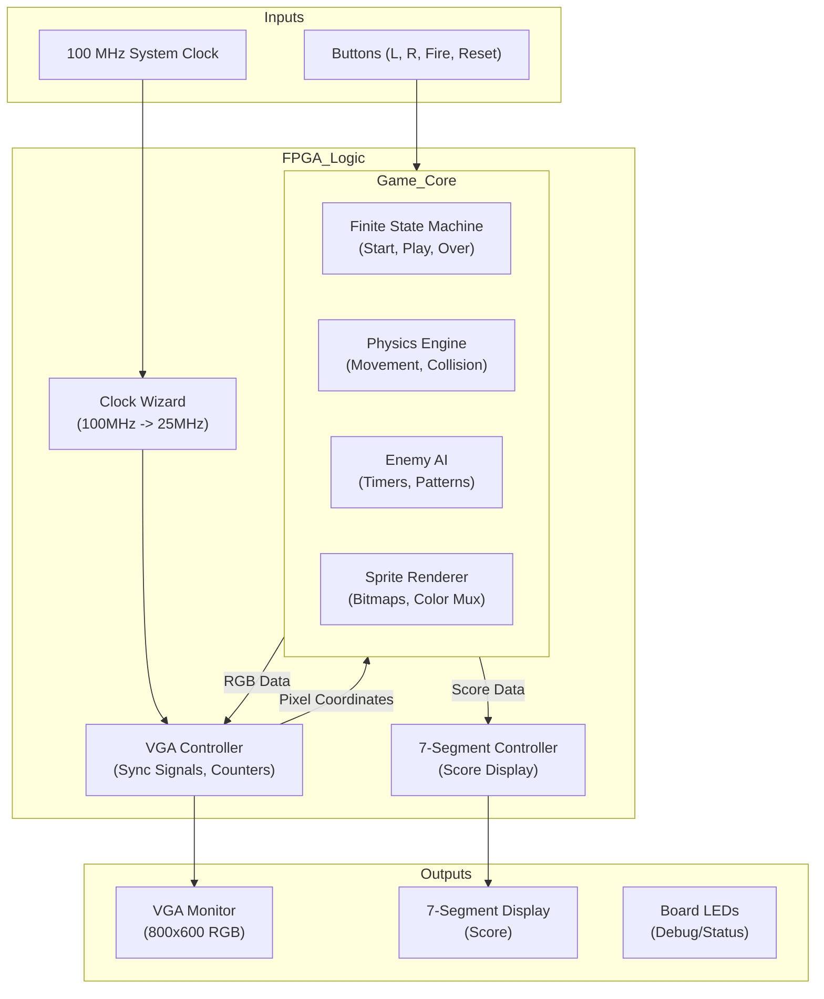

# Final Project: Video Game Galaga (CPE 487)

This project implements a sophisticated recreation of the arcade classic **Galaga** on the Digilent Nexys A7-100T FPGA board. Written entirely in VHDL, the system features a custom VGA graphics engine, complex enemy AI, sprite-based rendering, and a finite state machine (FSM) game loop.

The project demonstrates advanced digital logic design concepts including:
*   **VGA Signal Generation:** Custom timing logic for 800x600 @ 60Hz resolution.
*   **Sprite Rendering:** Pixel-perfect bitmap rendering for the player and multiple enemy types.
*   **Finite State Machines:** Managing game states (Start, Play, Next Wave, Game Over, Results).
*   **Pseudo-Random Number Generation (PRNG):** Using hash-based algorithms for starfield generation and enemy attack patterns.
*   **Collision Detection:** Real-time bounding box checks for multiple moving objects.

## Detailed Game Mechanics

### 1. The Player
The player controls a fighter ship at the bottom of the screen.
*   **Movement:** Smooth horizontal movement using `BTNL` and `BTNR`.
*   **Weaponry:** A rapid-fire cannon (`BTN0`) capable of destroying enemies in a single hit.
*   **Lives:** The player starts with 3 lives. A life is lost upon collision with an enemy ship or an enemy projectile.

### 2. The Enemy Fleet
The core of the game is the enemy formation, which evolves in difficulty.
*   **Formation Grid:** A 6-row by 10-column grid of enemies.
*   **Enemy Classes:**
    *   **Bees (Yellow):** Agile units in the front rows (Rows 4-5).
    *   **Crabs (Red):** The bulk of the force in the middle rows (Rows 2-3).
    *   **Walkers (Magenta):** Elite units in the back rows (Rows 0-1), appearing in later waves.
*   **Dynamic Behaviors:**
    *   **"Breathing" Formation:** The entire grid expands and contracts vertically while moving horizontally, mimicking the organic movement of the original game.
    *   **Dive Attacks:** Individual enemies will break formation and swoop down towards the player in a curve.
    *   **Squad Fly-Ins:** A "Squad Leader" (Bee) accompanied by two "Wingmen" (Crabs) will occasionally fly in from the side of the screen in a coordinated attack pattern.
    *   **Enemy Fire:** Enemies utilize two types of attacks:
        *   **Single Shot:** Randomly fired from the formation based on a difficulty timer.
        *   **Triple Shot:** Fired by diving enemies, spreading out to cover a wide area.

### 3. Game Progression & Scoring
*   **Infinite Waves:** The game has no end. When a wave is cleared, a new wave begins with increased difficulty (faster movement, higher fire rate).
*   **Scoring System:**
    *   **Formation Kill:** 10 Points.
    *   **Diver Kill:** 50 Points (Bonus for hitting a moving target).
*   **Results Screen:** Upon Game Over, a detailed statistics screen displays:
    *   Total Score
    *   Shots Fired
    *   Number of Hits
    *   Hit/Miss Ratio (Accuracy %)

## Instructions to Run the Project

### 1. Project Setup in Vivado
1.  Create a new RTL project named **galaga**.
2.  Select the target board: **Nexys A7-100T**.
3.  Add the following source files (VHDL):
    *   `galaga.vhd`
    *   `galaga_game.vhd`
    *   `vga_sync.vhd`
    *   `leddec16.vhd`
    *   `clk_wiz_0.vhd` & `clk_wiz_0_clk_wiz.vhd`
4.  Add the constraint file:
    *   `galaga.xdc`

### 2. Synthesis & Implementation
1.  Click **Run Synthesis** and wait for completion.
2.  Click **Run Implementation**.
3.  Click **Generate Bitstream**.

### 3. Programming
1.  Connect the Nexys A7 board to your PC via USB.
2.  Open **Hardware Manager** > **Open Target** > **Auto Connect**.
3.  Click **Program Device** and select the `galaga.bit` file.

### 4. Controls
| Button | Action |
| :--- | :--- |
| **BTNL** | Move Ship Left |
| **BTNR** | Move Ship Right |
| **BTN0 (Center)** | Fire Laser |
| **BTNU (Up)** | Reset Game |

## Technical Implementation

### System Architecture
The design is modular, separating the game logic from the display drivers and input handling.

### Key Modules
*   **`galaga.vhd` (Top Level):** Instantiates all sub-modules and maps physical ports. Handles the global reset and clock distribution.
*   **`galaga_game.vhd` (Game Engine):** The largest module (approx. 1300 lines). It contains:
    *   **Sprite Bitmaps:** Constant arrays defining the 16x16 pixel art for all characters.
    *   **Starfield Generator:** A mathematical hash function based on pixel coordinates to generate a scrolling star background without using memory.
    *   **Object Tracking:** Arrays and signals to track the position and status (`alive`/`dead`) of 60+ entities simultaneously.
*   **`vga_sync.vhd`:** Generates standard VESA 800x600 timing signals. It provides the current `pixel_row` and `pixel_col` to the game engine, which determines the color of that pixel in real-time.
*   **`leddec16.vhd`:** Multiplexes the 4-digit score onto the 7-segment display.

## Modifications
We began with the base code from Lab 6, which was Pong. Using this starter code allowed us to easily implement the game. We kept `vga_sync.vhd`, `leddec16.vhd`, `clk_wiz_0.vhd`, and `clk_wiz_0_clk_wiz.vhd` unchanged. This keeps the functionalities of the system and display clock, the LED display, and VGA timing signals. The constraint file, `pong.xdc`, was renamed to `galaga.xdc`.

### Constraint File Modifications
Within `galaga.xdc`, we implemented the mappings for an additional button. We mapped the up button to be used for our restart button. We also added the mappings for the LED outputs. The LED outputs are used to display the lives remaining. 

### Galaga Modifications
The file organization from Pong was used to implement Galaga. In the Pong game, there was the top level file named `pong.vhd` and the game mechanics were within a file named `bat_n_ball.vhd`. Other than the file structure, these files were almost entirely changed. 

#### galaga.vhd
This file begins with the entity declaration definining the inputs and outputs as followed:
* Inputs:
   * `clk_in`: System clock
   * `btnl`, `btnr`, `btn0`, `btnu`: Buttons (left, right, shoot, reset)
* Outputs:
   * `VGA_red/green/blue`: VGA color (4 bit vectors)
   * `VGA_hsync`, `VGA_vsync`: VGA sync signals
   * `led`: LEDs for lives indicator (16 bit vectors)
   * `SEG7_anode`, `SEG7_seg`: 7-segment display control

 Within the architecture, many internal signals were declared:
 * `pxl_clk`: Pixel clock
 * `S_red/green/blue`: Single bit color from game
 * `S_red_vec/green_vec/blue_vec`: 4-bit color vectors for VGA
 * `S_vsync`: Vertical sync from VGA module.
 * `S_pixel_row/col`: Current pixel coordinates
 * `player_pos`: Player X position
 * `count`: Counter for debouncing and multiplexing
 * `display`: BCD score for 7-segment display
 * `score_binary`: Binary score from game
 * `led_mpx`: Multiplexing selector for 7-segment digits
 * `shoot_signal`: Shoot button signal
 * `lives_out`: Lives count from game

## Required Hardware
*   **FPGA:** Digilent Nexys A7-100T (Artix-7).
*   **Display:** Standard VGA Monitor (supports 800x600 @ 60Hz).
*   **Connection:** VGA Cable (or HDMI with active VGA adapter).
*   **Power/Prog:** Micro-USB cable.

## Future Improvements
*   Add sound effects using the PWM audio output.
*   Implement a high-score retention system.
*   Add "Challenging Stages" (bonus rounds) similar to the original arcade game.
